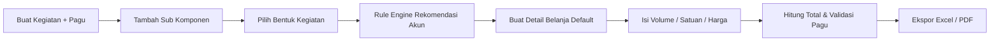

# Arsitektur Aplikasi RAB Workflow Assistant

## Tujuan
Aplikasi dirancang sebagai assistant penyusunan RAB kegiatan kementerian berbasis alur kerja bisnis, bukan tabel input anggaran manual.

## Lapisan Sistem
1. Frontend SPA ringan dengan vanilla JavaScript.
   Mengelola wizard/stepper, editor master-detail, state UI, dan komunikasi ke backend REST API.
2. Backend FastAPI.
   Menangani CRUD kegiatan, sub komponen, bentuk kegiatan, rule engine akun, validasi pagu, dan ekspor.
3. SQLite domain store.
   Menyimpan master referensi, mapping rule, data transaksi RAB, dan referensi biaya hasil import workbook SBM.
4. Service layer.
   Mengenkapsulasi rule engine, kalkulasi total, seed sample data, serta importer dan exporter.

## Workflow Bisnis

## Komponen Data
- `activities`
  Menyimpan metadata kegiatan dan pagu anggaran.
- `sub_components`
  Menyimpan tahapan kegiatan dengan kode otomatis `A/B/C/...`.
- `activity_form_selections`
  Menyimpan bentuk kegiatan yang dipilih user per tahapan.
- `budget_accounts`
  Master akun belanja.
- `budget_account_selections`
  Akun hasil rekomendasi rule engine atau tambahan manual user.
- `account_detail_templates`
  Template detail item per akun.
- `budget_lines`
  Baris anggaran aktual yang diisi user.
- `account_rules`
  Rule mapping bentuk kegiatan ke akun belanja.
- `cost_references`
  Tarif referensi yang diimport dari workbook SBM.

## Rule Engine
Rule engine bersifat deklaratif:
1. Baca semua bentuk kegiatan dalam satu sub komponen.
2. Muat rule dari `account_rules`.
3. Cocokkan `condition_json` terhadap atribut bentuk kegiatan.
4. Upsert akun rekomendasi ke `budget_account_selections`.
5. Jika akun aktif dan belum punya detail, buat detail default dari `account_detail_templates`.
6. Isi harga awal berdasarkan `cost_references` hasil import SBM.

## Sumber Tarif SBM
Workbook `DATA LAMPIRAN PMK 32 2025.xlsx` diimport ke `cost_references` dengan normalisasi kategori utama:
- `honorarium`
- `daily_allowance_domestic`
- `hotel_domestic`
- `meeting_package`
- `vehicle_rent`
- `consumption_regular`
- `land_transport_domestic`
- `airport_taxi_domestic`
- `flight_domestic_pp`

## Validasi
- Total per line = `volume x unit_price`
- Total akun = agregasi `budget_lines.amount`
- Total sub komponen = agregasi akun aktif
- Total kegiatan = agregasi semua sub komponen
- Sisa pagu = `budget_ceiling - grand_total`
- Warning muncul bila:
  - total melebihi pagu
  - ada detail aktif dengan harga `0`
  - belum ada akun aktif yang membentuk total anggaran

## API Utama
- `GET /api/activities`
- `POST /api/activities`
- `PATCH /api/activities/{id}`
- `POST /api/activities/{id}/sub-components`
- `POST /api/sub-components/{id}/forms`
- `PATCH /api/accounts/{id}/toggle`
- `POST /api/accounts/{id}/lines`
- `PATCH /api/lines/{id}`
- `GET /api/activities/{id}/summary`
- `GET /api/activities/{id}/export/xlsx`
- `GET /api/activities/{id}/export/pdf`

